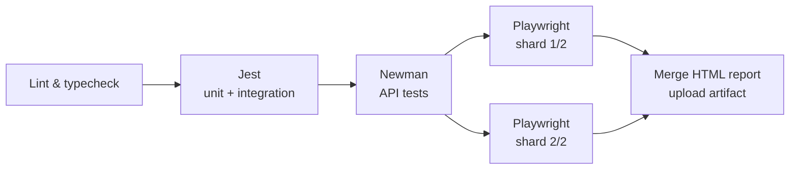
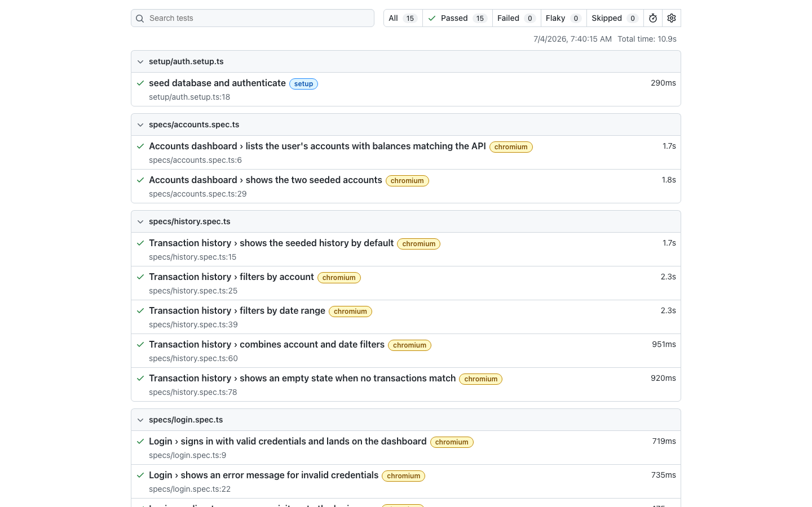

# playwright-banking-e2e

[](https://github.com/eduardo-afonsojr/playwright-banking-e2e/actions/workflows/ci.yml)

A test-architecture showcase. The application — a small banking app (login,
accounts dashboard, transfers, transaction history) built with Next.js 14,
TypeScript and MongoDB — is deliberately simple: it exists to be tested. The
point of this repository is the quality layer wrapped around it:

| Layer | Tooling | What it covers |
|---|---|---|
| E2E | Playwright + TypeScript, Page Object Model | User journeys: login, account listing, transfers, history filtering |
| Unit | Jest | Business rules (transfer validation) in isolation |
| Integration | Jest + real MongoDB | API route handlers, persistence, auth |
| Component | Testing Library | Form behavior with mocked boundaries |
| API contract | Postman collection via Newman | Every endpoint, happy paths and error codes |
| CI | GitHub Actions (+ GitLab CI mirror) | Sequential quality gates, sharded E2E, report artifacts |

## The demo application

A seeded user (`jane.doe` / `Password123!`) owns two accounts and can move
money between them. Four API routes back the UI, all MongoDB-backed:

- `POST /api/auth/login` — credentials auth; opaque session token stored in
  MongoDB (TTL-indexed) and delivered as an httpOnly cookie
- `GET /api/accounts` — the user's accounts and balances
- `POST /api/transfers` — validates and executes transfers (insufficient
  funds, negative/zero/sub-cent amounts, same-account, unknown account)
- `GET /api/transactions` — history with account and date-range filters

A single seed module (`src/lib/db/seed.ts`) resets the database to a known
state: one user, two accounts, and 12 transactions spread over 35 days so
date-range filtering has meaningful data. The CLI (`npm run seed`), the
Playwright setup project, and the Jest integration tests all import the same
function — test data cannot drift from the app.

## Repository layout

```
├── src/                  # the application (test subject)
│   ├── app/              # pages + API route handlers
│   ├── components/       # client components (forms, nav)
│   └── lib/              # business logic, auth, db, seed
├── e2e/                  # Playwright
│   ├── pages/            # page objects (+ components/NavBar)
│   ├── fixtures/         # custom test fixture, test data
│   ├── setup/            # seed + authenticate (storage state)
│   └── specs/            # login, accounts, transfer, history
├── tests/                # Jest
│   ├── unit/             # transfer validation rules
│   ├── integration/      # API routes against real MongoDB
│   ├── components/       # Testing Library
│   └── helpers/          # env setup, cookie mock, api helpers
├── api-tests/            # Postman collection + environment (Newman)
├── .github/workflows/    # GitHub Actions pipeline
└── .gitlab-ci.yml        # GitLab CI mirror
```

## Architecture decisions

### Why Page Object Model

Specs read as user intent (`transferPage.submitTransfer(...)`), selectors
live in exactly one place, and the compiler enforces the contract between
specs and pages. Two conventions keep the POM honest:

- **Assertions stay in specs.** Page objects expose locators and actions;
  they never decide what "correct" looks like.
- **Shared UI is a component object.** The navigation bar appears on every
  authenticated page, so it is modeled once (`e2e/pages/components/NavBar.ts`)
  and composed into each page object instead of duplicated.

A custom fixture (`e2e/fixtures/test.ts`) injects ready-made page objects
into every spec, so specs never instantiate pages by hand.

### Authentication: storage state via API, not the UI

A Playwright *setup project* runs once before the browser projects: it
reseeds the database and signs in through the real `POST /api/auth/login`,
saving the session cookie as storage state. Authenticated specs start
already logged in; only the login specs exercise the form, opting out with
an empty `storageState`. Logging in through the UI in every test would be
slower and would make every spec transitively depend on the login form.

### Flaky-test strategy

Parallel suites fail in ways sequential suites never reveal. The rules used
here, each of which earned its place:

- **Only one spec file mutates data** (`transfer.spec.ts`), and it runs its
  tests sequentially while every other file stays fully parallel. The first
  CI-style run of this suite caught a real race: the mutating transfer ran
  concurrently with another spec's before/after balance comparison.
- **Relative assertions for mutable state.** The transfer spec reads
  balances via the API and asserts deltas; the dashboard spec asserts
  UI-vs-API consistency instead of hardcoded amounts. Both stay correct no
  matter how many times the suite has already run.
- **Date windows exclude "today".** History-filter specs use
  `[30 days ago, yesterday]`, so transactions created by concurrently
  running specs (always dated *now*) can never leak into the expected set.
- **Traces on first retry, retries in CI only.** Locally a failure should
  fail loudly; in CI the retry captures a full trace for the HTML report.
- **Deterministic seed, reset at suite start** — no test depends on leftover
  state from a previous run.

The same thinking shows up in the Postman collection: the automatic cookie
jar is disabled on every request and the session token is sent explicitly,
because otherwise Postman silently attaches the logged-in cookie to the
*unauthenticated* 401 tests, making them order-dependent.

### Test pyramid: what runs where, and why

- **Validation rules** (`src/lib/transfers/validation.ts`) are a pure module
  with no framework or database dependency — unit-tested exhaustively,
  including boundaries (exact balance, $0.01, NaN, sub-cent precision) and
  rule precedence.
- **API routes** are integration-tested by calling the handlers directly as
  functions against a real MongoDB — no HTTP server, but real persistence
  and real auth. Each Jest worker gets its own database
  (`banking_test_${JEST_WORKER_ID}`), so test files parallelize safely.
- **Newman** exercises the full HTTP surface (serialization, cookies, status
  codes) against a running production build.
- **Playwright** is reserved for what only a browser can verify: journeys,
  navigation, rendered state, native form validation.

## CI pipeline



Sequential gates ordered by cost: the cheapest checks fail first. Every test
job gets a health-checked MongoDB 7 service container. The Newman and
Playwright stages run against the **production build** (`next build` +
`next start`), not the dev server. E2E shards emit blob reports that a final
job merges into a single HTML report, published as an artifact **even when a
shard fails** — that is exactly when the report matters. Superseded runs on
the same branch are auto-cancelled.

### GitLab CI mirror

[`.gitlab-ci.yml`](.gitlab-ci.yml) mirrors the pipeline stage-for-stage — my
professional background is GitLab CI, and the mirror documents the
equivalences directly in the config:

| GitHub Actions | GitLab CI |
|---|---|
| `needs:` between jobs | `stages:` ordering |
| `strategy.matrix` shards | `parallel: 2` + `CI_NODE_INDEX/CI_NODE_TOTAL` |
| service on mapped `localhost` port | service reachable by hostname (`mongo`) |
| `playwright install --with-deps` | official `mcr.microsoft.com/playwright` image |
| upload/download artifact actions | `artifacts:` + `needs:` between jobs |

## Playwright report



In CI the merged report is uploaded as the `playwright-report` artifact on
every run.

## Running locally

Prerequisites: Node 20+, Docker (for MongoDB).

```bash
docker compose up -d      # MongoDB 7 on localhost:27017
npm ci
npm run seed              # reset the database to the known state
npm run dev               # app on http://localhost:3000
```

Sign in with `jane.doe` / `Password123!`.

Each test layer independently:

```bash
npm run lint              # ESLint
npx tsc --noEmit          # typecheck
npm test                  # Jest unit + integration (needs MongoDB up)
npm run test:api          # Newman (needs the app running on :3000)
npm run test:e2e          # Playwright (starts its own server if needed)
npm run test:e2e:report   # open the last HTML report
```
